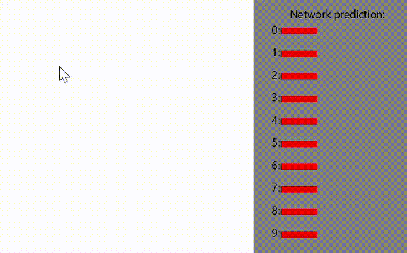
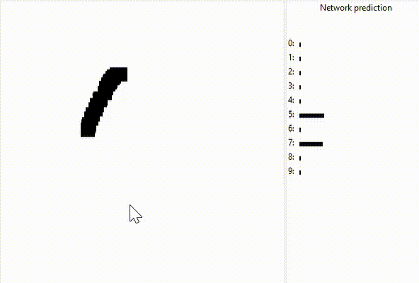

# Neural-Network
Neural network for recognizing handwritten digits. Provided in java and python implementations(java one has better drawing app).

Java | Python
:-------------------------:|:-------------------------:
  |  

Training data taken from [http://yann.lecun.com/exdb/mnist/](http://yann.lecun.com/exdb/mnist/) .

Math part of this project was inspired by Michael A. Nielsen, "Neural Networks and Deep Learning", Determination Press, 2015.
