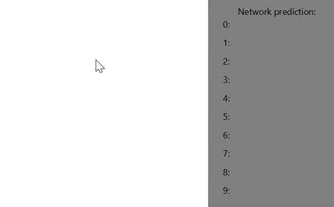

# Java version
Written in Java. Provided with application for drawing own examples.  
Application interface:  
<!--  -->

You may load pretrained instance of `Network` class from network.dat using `loadNetwork` method(more details in [uml.pdf](https://github.com/gekas145/Neural-Network-MNIST/blob/master/java_version/uml.pdf)).
