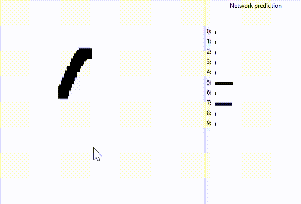

# Python version

Sigmoidal feedforward neural network for recognizing handwritten digits. Uses mini batch stochastic gradient descent for learning.

See how usage of regularization and smart weights initializing contributes to convergence:

  
  

Test the pretrained net with own examples using drawing app:

